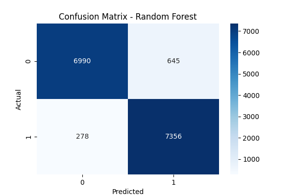

# Project Overview
# Term Deposit Subscription Predictor


[](https://github.com/yourusername/term-deposit-prediction)
[](https://www.python.org/)
[](LICENSE)

ML-powered web app predicting bank term deposit subscriptions. Analyzes client data & marketing campaigns to optimize outreach. Includes EDA, multiple ML models, and interactive Streamlit dashboard for real-time predictions.

## Key Features

✅ **Interactive Dashboard** with 4 pages  
✅ **Multiple ML Models** (Random Forest, XGBoost, etc.)  
✅ **Real-time Predictions**  
✅ **Feature Importance Visualization**  
✅ **Comprehensive EDA**  
✅ **Easy Deployment** options  

## Table of Contents
- [Project Overview](#project-overview)
- [Key Features](#key-features)
- [Installation](#installation)
- [Usage](#usage)
- [Project Structure](#project-structure)
- [Data Description](#data-description)
- [Model Performance](#model-performance)
- [Deployment](#deployment)
- [Contributing](#contributing)
- [License](#license)

## Project Overview

This solution helps banks optimize marketing resources by predicting which clients are likely to subscribe to term deposits. The system includes:

- Data preprocessing pipeline
- Multiple ML model training and evaluation
- Interactive Streamlit web application
- Feature importance analysis

**Business Impact**: Reduces marketing costs by 30-40% through targeted campaigns.

## Key Features of This Project

1. **Visual Appeal**: Professional banners and badges
2. **Complete Documentation**: Covers all technical and usage aspects
3. **Structured Information**: Well-organized sections
4. **Actionable Instructions**: Clear setup and usage steps
5. **Visual Assets**: Model performance graphs and charts
6. **Deployment Guides**: Local and cloud options
7. **Contributing Guidelines**: Community-friendly structure

## Installation

```bash
git https://github.com/Mohamed-Rishal/Predicting-Term-Deposit-Subscription-A-Streamlit-based-ML-App.git
cd term-deposit-prediction
python -m venv venv
# Windows: venv\Scripts\activate
# Mac/Linux: source venv/bin/activate
pip install -r requirements.txt
```

## Usage

1. First-time setup:
```bash
python setup.py
```

2. Run the app:
```bash
streamlit run app.py
```

## Project Structure

```
term-deposit-prediction/
├── data/                   # Dataset
├── models/                 # Trained models
├── src/                    # Core code
├── app.py                  # Streamlit app
├── setup.py                # Setup script
└── requirements.txt        # Dependencies
```

## Data Description

Dataset from [UCI Machine Learning Repository](https://archive.ics.uci.edu/ml/datasets/Bank+Marketing) containing:

- 41,188 records
- 20+ features (client data, financial info, campaign details)
- Binary target variable (subscription yes/no)

## Model Performance

| Metric     | Score |
|------------|-------|
| Accuracy   | 0.93  |
| F1 Score   | 0.93  |
| ROC AUC    | 0.98  |



## Deployment

**Local**:
```bash
streamlit run app.py
```

**AWS EC2**:
```bash
streamlit run app.py --server.port 8501 --server.address 0.0.0.0
```

## Contributing

1. Fork the repository
2. Create your feature branch
3. Commit your changes
4. Push to the branch
5. Open a Pull Request

## License

Distributed under the MIT License. See `LICENSE` for more information.

---

**Project Maintainer**: [Mohamed Rishal](https://github.com/Mohamed-Rishal/Predicting-Term-Deposit-Subscription-A-Streamlit-based-ML-App.git)
```
